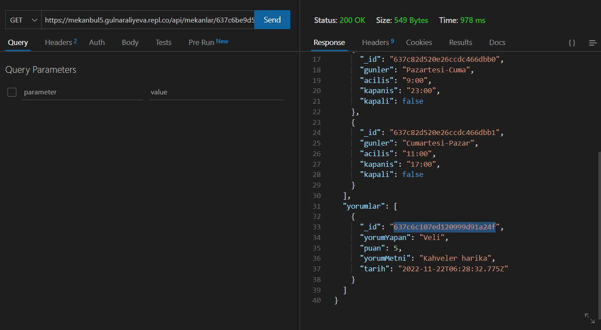
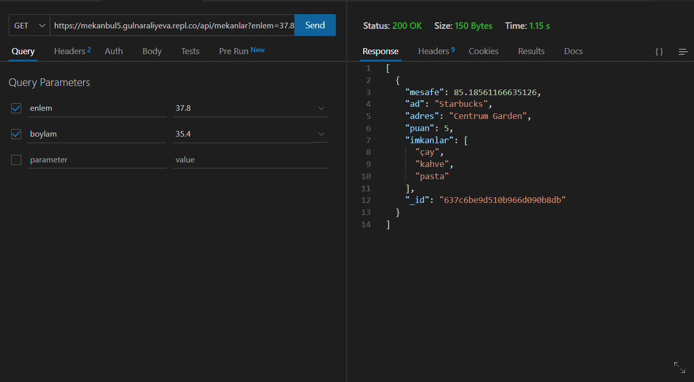
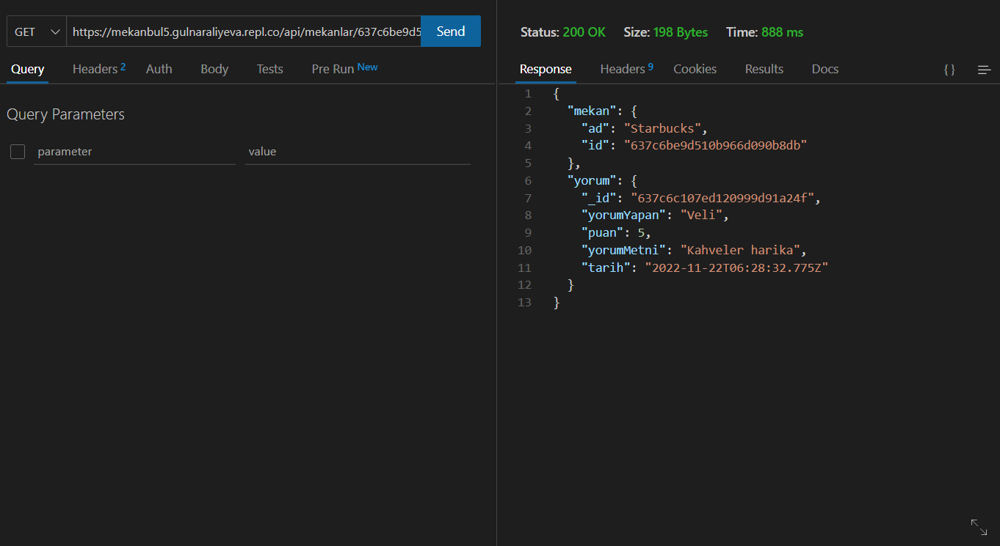

# Mekanbul REST API Adresleri
[1. Mekan ID ile mekanlari getir:](https://mekanbul5.gulnaraliyeva.repl.co/api/mekanlar/637c6be9d510b966d090b8db)

[2. Mekan ID ile konum bilgilerini getir:](https://mekanbul5.gulnaraliyeva.repl.co/api/mekanlar?enlem=37.8&boylam=35.4)

[3. Bir mekana ait bir yorumu getir:](https://mekanbul5.gulnaraliyeva.repl.co/api/mekanlar/637c6be9d510b966d090b8db/yorumlar/637c6c107ed120999d91a24f)

# API Test

# API COLLECTIONS TEST
